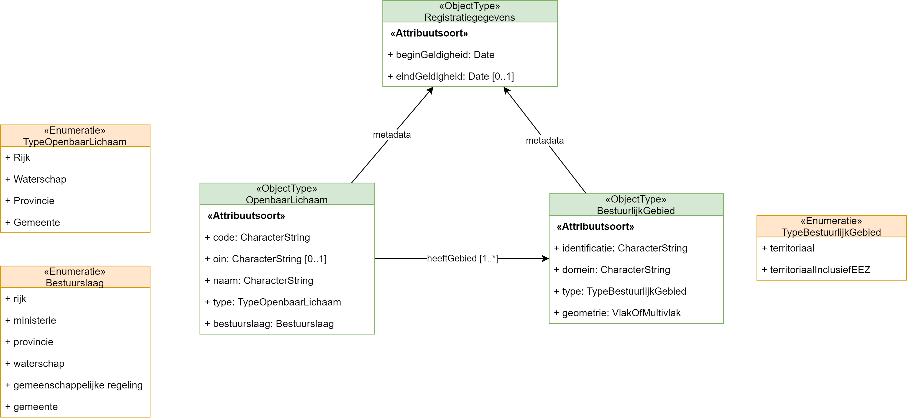

# Tips

## Maven

Start application
```bash 
mvn spring-boot:run
```
## Information Model
The information model



### Endpoints
- http://localhost:8080/bestuurlijkegebieden (re)load all bestuurlijkegebieden
- http://localhost:8080/openbarelichamen (re)load all openbarelichamen

### Show dependencies
See https://javadeveloperzone.com/maven/maven-show-dependency-tree/
```bash
mvn dependency:tree
mvn dependency:tree -Dverbose
```
## GeoJson
See 
- https://gis.stackexchange.com/questions/130913/geojson-java-library
- google gson  https://github.com/google/gson

## Postgres
- Create spatial database https://www.techiediaries.com/postgresql-postgis-tutorial/
- Postgis http://postgis.net/docs/manual-3.1/
- Liquibase and Geo http://lonnyj.github.io/liquibase-spatial/geometry_data_type.html

### Create database
Become user postgres and create the database
```shell
sudo su - postgres
createdb ambtsdb
```
### Add postgis extension
As postgres user
```shell
psql ambtsdb
```
When postgres starts:
```sql
create extension postgis;
create extension postgis_topology;
```
A Postgis tutorial can be found on: https://www.postgis.net/workshops/postgis-intro/
### Create user
As postgres user
```shell
createuser testuser
```
### Grant access
As user postgres open database and grant access
```shell
psql ambtsdb
```
When postgres starts:
```sql
grant all privileges on database ambtsdb to bvpelt;
grant all privileges on database ambtsdb to testuser;
```
### Get access
```shell
psql -h localhost -d ambtsdb 
psql -h localhost -d ambtsdb --username testuser
```

### Spatial
See https://www.baeldung.com/hibernate-spatial for an example

### Convert from postgres to gml
```shell
ogr2ogr -f GML export.gml PG:'dbname=ambtsdb user=testuser host=localhost' bestuurlijkgebied
```

# References
- Geo spation example https://mkyong.com/spring-boot/spring-boot-spring-data-jpa
- https://postgis.net/workshops/postgis-intro/indexing.html
- Hibernate spatial tutorial http://www.hibernatespatial.org/documentation/02-Tutorial/01-tutorial4/
- https://docs.spring.io/spring-data/jpa/docs/1.5.0.RC1/reference/html/jpa.repositories.html
- used as part of hibernate spatial https://locationtech.github.io/jts/javadoc/index.html
- jts implementation https://locationtech.github.io/jts/
- https://www.baeldung.com/hibernate-spatial
- maven packages/classes https://repository.sonatype.org/
- API Specification for bestuurlijkegrenzen https://brk.basisregistraties.overheid.nl/api/bestuurlijke-grenzen/v2 - api key needed
- Swagger https://editor.swagger.io/
- Spring Boot initializer https://start.spring.io/
- https://www.javaguides.net/2018/09/spring-data-jpa-repository-testing-using-spring-boot-datajpatest.html
- read geojson -> java https://stackoverflow.com/questions/53957417/parse-geojson-file-with-java-topology-suite-or-geotools
- see https://github.com/bjornharrtell/jts2geojson/tree/master/src/main/java/org/wololo/geojson
- see https://stackoverflow.com/questions/10329706/json-deserialization-into-other-class-hierarchy-using-jackson/10336625#10336625
- see https://www.baeldung.com/jackson-annotations
- see https://www.baeldung.com/jackson-exception
- see https://www.baeldung.com/jackson
- see https://stackoverflow.com/questions/29739972/how-to-get-geojson-from-spring-rest-controller
    - see https://github.com/bedatadriven/jackson-datatype-jts#reading-and-writing-geometry-types
- see https://stackoverflow.com/questions/45713934/jackson-deserialize-geojson-point-in-spring-boot
- see https://stackoverflow.com/questions/64724130/kotlin-and-jackson-missing-type-id-when-trying-to-resolve-subtype-of-simple-ty
- see https://www.xspdf.com/resolution/53220889.html
- see https://auth0.com/blog/integrating-spring-data-jpa-postgresql-liquibase/ example jpa postgres liquibase authentication
- see https://dokumen.pub/qdownload/postgresql-high-performance-cookbook-mastering-query-optimization-database-monitoring-and-performance-tuning-for-postgresql-9781785284335-1785284339-9781785287244-1785287249.html for documentation on postgresql
